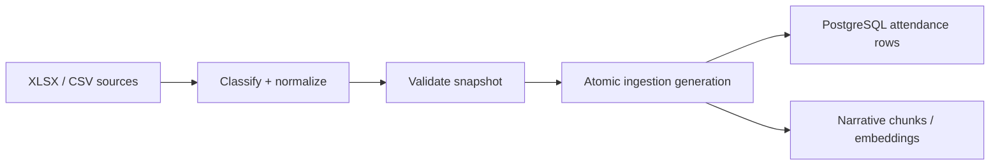

# Attendance architecture

The project has one online attendance runtime, `attendance-online/v1`, and one
independent offline ingestion flow. The online runtime uses three configured model
roles: employee-reference/request rewriting, SQL planning, and final answering. The
answer model is called twice independently with different prompts—once to write and
once to verify the answer.

## Online direct-SQL flow

```mermaid
flowchart LR
    A[Request + history + trusted state] --> B[Reference model rewrites request]
    B --> C[Authorized PostgreSQL employee resolution]
    C -. unresolved name .-> D[PostgreSQL fuzzy then Chroma candidates]
    D -. explicit confirmation .-> C
    C --> E[Attach authoritative names and IDs]
    E --> F[Load immutable physical database context]
    F --> G[Project schema for this request]
    G --> H[SQL planner returns one PostgreSQL string]
    H --> I[Bounded read-only direct execution]
    I --> J[Answer model receives SQL, result, coverage, employees]
    J --> K[Same model independently verifies]
    K --> L[Atomic trusted-state publication]
```

The reference model receives the original request, untrusted conversation history,
and labelled trusted conversation state. It returns a complete rewritten request,
typed employee IDs, names and paired identity claims, general employee criteria, and
their union/intersection relationship. It receives no database schema and produces no
SQL. Explicit employees are resolved only inside the caller's authorized PostgreSQL
directory. Exact ID/name resolution is followed by whole-name and, when needed,
first-name token PostgreSQL candidate searches, then confirmation-only Chroma
candidates that are cross-checked against
that authorized directory. Unknown standalone IDs receive no suggestions.
Employee names and narrative chunks use the configured Hugging Face or OpenAI
embedding provider in separate, model-specific Chroma collections. Narrative text
is split to the selected model's token limit before embedding.

`online/context.py` builds a frozen physical database context from the configured
attendance object allowlist. It includes PostgreSQL version, exact table/view and
column names, types, nullability, descriptions, and known stored values. The current
allowlist contains the attendance table, so no cross-table relationships are needed.
The context excludes row samples, credentials, system catalogs,
authentication/configuration objects, migrations, and private ingestion tables.

One `SharedModelContext` carries the explicit current question, rewritten request,
conversation history, trusted context, and database metadata through the pipeline.
Before the planner call, `online/planner.py` makes a request-specific schema projection:
all typed columns and descriptions remain, JSON entries duplicated by typed columns
are removed, and only request-relevant JSON-only fields are retained. The complete
schema is normally sent once, to the planner; it is sent again only if an eligible SQL
retry is needed. The answer writer and verifier do not receive the schema. They receive
the question, rewritten request, history, trusted context, database date-coverage
summary, executed SQL, typed result and result coverage, authoritative employees, and
locale. The verifier also receives the proposed answer.

Each physical attendance column has an authored semantic description. Context loading
fails if PostgreSQL exposes a column without one, and the planner prompt requires the
model to study names, types, nullability, descriptions, and standard values before
choosing SQL fields.

The `record_json` JSONB column additionally exposes a nested catalog for every source
attendance field, including its exact JSON expression, normalized type, stored values,
and business meaning. `Actual_From_*` and `Actual_To_*` are the immutable original
swipe-device facts. `From_*` and `To_*` describe the same swipes but are the
admin-clerk-adjustable, payroll-effective values used for salary and payable-time
calculations. A positive `Total_Worked_Hrs` is evidence that work occurred; null,
empty, or zero is not attendance evidence and must be interpreted with leave and
exception fields.

The active model roles use `ollama_chat/qwen3.5:4b` for reference/rewrite and
answering, and `ollama_chat/gpt-oss:20b` for SQL planning. Local GPT-OSS calls use
`reasoning_effort="medium"`; other local models use `reasoning_effort="none"`.
All use temperature 0. The planner output limit is 512 tokens. The answer role is
called separately for writing and verification.

`Actual_From_*` and `Actual_To_*` are immutable swipe-device facts. `From_*` and
`To_*` are payroll-effective values that clerks may adjust and should be used for
payroll calculations. Positive `total_worked_hrs` proves attendance; zero or null
alone does not prove absence. Explicit absence is `exception = 'Absent'`. Scheduled
working dates use `day_type = 'Working Day'`. A generic off-day request includes both
`'OFF Day'` and `'OFF Day (ZAS)'`. Typed relational columns take precedence over
`record_json` fallbacks.

The SQL planner returns one complete PostgreSQL SQL string. Complex SQL, CTEs,
nested queries, grouping, and aggregates are allowed. There is no active flat-query model,
logical catalog, semantic-audit model, application SQL compiler, narrative route, or
typed-fact compatibility layer.

The exact model SQL runs directly in a read-only, repeatable-read PostgreSQL
transaction. The executor retains connection, statement, lock, idle-transaction,
row-count, response-size, rollback, and safe-failure bounds. There is exactly one
initial SQL execution and at most one retry, only after `psycopg.ProgrammingError` or
`psycopg.DataError`. The retry planner receives the failed SQL, error type, database
error text (capped at 4,000 characters), and the same question, history, trusted
context, and schema projection. Connection, timeout, result-bound, authorization,
provider, and answer failures do not trigger SQL retry. Only a verified answer
publishes the original request, rewritten request, authoritative employees, executed
SQL evidence, typed result, and answer atomically. Clarification may publish only one
pending employee confirmation; failures preserve the prior trusted state.

Requests outside the attendance domain stop before SQL planning. Malformed employee
identifier shapes and recognized invalid date or numeric literals stop safely before
planning; unresolved employee references clarify, and unknown standalone IDs receive
no alternatives. If the planner cannot represent an attendance concept, it returns a
safe `SELECT` with the `unsupported_capability` alias; execution surfaces that as an
unsupported outcome without publishing a verified turn. Empty or malformed provider
responses fail safely. Planner Markdown fences are rejected; SQL is otherwise passed
to PostgreSQL without structural parsing or rewriting.

## Explicit security limitation

Direct model-generated SQL is not structurally secured by the application. The
runtime does **not** parse a PostgreSQL AST, require exactly one read-only statement,
validate returned tables/columns/functions/operators/joins, inject server-owned row
authorization, inject a SQL limit, or replace model-authored literals with parameters.
The read-only transaction and database role prevent writes, but they do not prevent
unauthorized reads within that role, expensive valid queries, or malicious SQL caused
by prompt injection.

Future work is to add all of those structural safeguards: PostgreSQL-aware AST parsing,
single-read-only-statement enforcement, complete identifier/operation allowlists,
authorization rewriting outside model control, structural limits, and bound
parameters.

## Offline ingestion flow

Offline ingestion retains its snapshot, quarantine, ledger, PostgreSQL, and optional
vector behavior. It neither imports nor executes the online SQL planner.

## Public API

`week5/new_implementation/answer.py` remains the narrow compatibility facade exposing
only `answer_question`, `answer_question_with_state`, `ConversationState`,
`AccessContext`, `LOCAL_DEMO_ACCESS`, and `Result`.

## Colab verification and source sync

Deterministic online, evaluator, acceptance-checkpoint, and Gradio UI tests run from
the sanitized snapshot described in
[`new_implementation/colab/LOCAL_COLAB_SYNC_GUIDE.md`](new_implementation/colab/LOCAL_COLAB_SYNC_GUIDE.md).
That guide is the source of truth for packaging, the SHA-256-pinned Colab upload,
test execution, and optional live acceptance on a synthetic database. The 311-line
manifest sent to Colab is generated placeholder data and is not the private evaluation
corpus.

The latest executed snapshot
`d171a25ed2fe5cb11e3c2277ac10b8765a5fa33f1f7f4adaf571b827244ed60c`
passed 149 deterministic Colab tests and static checks. The current snapshot is newer
and remains untested because Colab returned `Service Unavailable` when creating a
replacement T4 runtime. Synthetic Gradio callback turns 1–4 were verified in the
long conversation. Turn 5 exposed grouped comparison errors: the planner applied
the department threshold to August only, and the writer misstated date coverage.
The acceptance oracle stopped the sequence before turns 6–8. Passing deterministic
checks does not establish live multi-turn accuracy.
