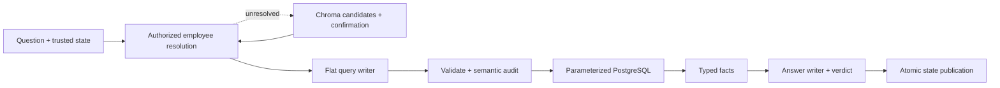
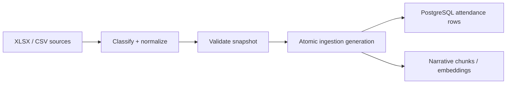

# Attendance architecture

The system has one online runtime, `attendance-online/v1`, and one independent
offline ingestion flow. The online path accepts one attendance question and produces
one verified answer, one clarification, one precise unsupported result, or one safe
failure. There are no alternate rollout modes or older planner paths.

## Online query and answer flow

The flat query supports Boolean filters (`condition`, `predicate`, `all`, `any`,
`not`) and exactly one rows or aggregate output. Aggregate output may group, apply
HAVING, order, and limit. Narrative retrieval is a separate scoped route. Multi-unit
execution, graph stages, macros, derivation, comparison, joins, sets, ranking,
windows, and planner-authored SQL are not part of the runtime.

`online/catalog.py` is the only online field and predicate authority. Prompts receive
logical identifiers; only the compiler can access physical PostgreSQL expressions.
Employee identity and server-owned row scope are bound before compilation. Main,
coverage, and witness queries all derive from the same immutable bound query.

State contains only the runtime version, session ID, verified turns, active employee
IDs, and optional pending employee options. Only a verified answer appends a
turn. A clarification may change only the confirmation; unsupported and failed turns
preserve the previous state.

## Offline ingestion flow

Offline ingestion retains its existing snapshot, quarantine, ledger, PostgreSQL, and
optional vector behavior. It does not import or execute the online planner.

## Public API

`week5/new_implementation/answer.py` is a compatibility façade exposing only:

- `answer_question`
- `answer_question_with_state`
- `ConversationState`
- `AccessContext`
- `LOCAL_DEMO_ACCESS`
- `Result`

New code should use `online.pipeline.run_turn(TurnRequest(...), observer=...)` when it
needs typed outcomes or stage events.

## Safety boundaries

- Provider transports use structured output and `num_retries=0`.
- One turn permits at most 11 decision-model calls: reference 2, semantic writer 2,
  audit/repair 3, and answer writer/verifier 4. Embeddings are measured separately.
- PostgreSQL exact/fuzzy resolution is primary. An unresolved written reference may
  use Chroma as a fallback. Chroma never binds identity: it returns at most five
  access-scoped options, each cross-checked against PostgreSQL, for user confirmation.
- Every user literal and result limit is a SQL parameter.
- PostgreSQL transactions are repeatable-read and read-only with bounded timeouts.
- Narrative retrieval fails closed without the identical enforceable employee scope.
- A rejected repair requires a passing final audit. Answer-verdict or authorization
  failure publishes no trusted turn.

## Verification

Deterministic results, the 311-case behavior score, live scenario evidence, static
checks, and final file/line counts are recorded in
`new_implementation/LLM_PLANNER.md`.
